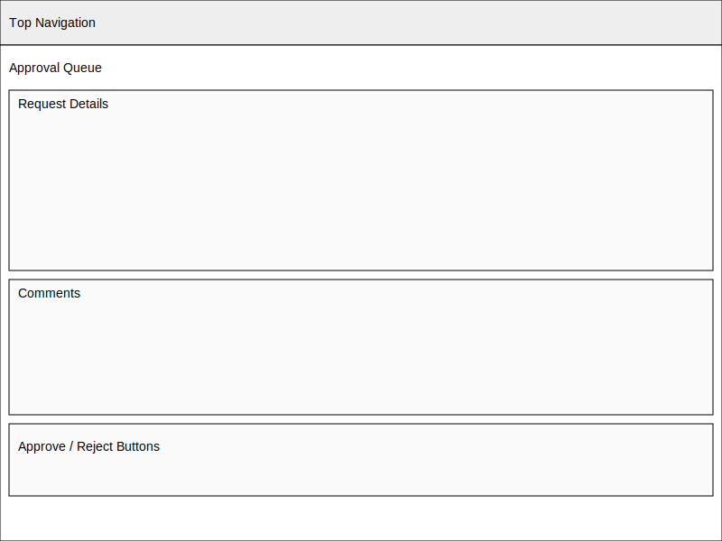

# Approvals Wireframe

The approvals console gives reviewers a concise queue of incoming requests alongside the context they need to make defensible decisions quickly.

## Layout Overview

- Primary table lists each pending request with the requester, amount, and current stage so approvers can triage at a glance.
- Filter chips along the top group items by SLA risk, category, or delegation path to focus on the most urgent work first.
- Selecting a row opens a detail drawer that surfaces the approval brief, attached documents, and recent activity without navigating away from the queue.

## Decision Controls

- Approve and Deny actions are paired with a comment field to capture conditions, clarifications, or follow-up tasks as part of the audit trail.
- Bulk controls let reviewers clear low-risk requests in sequence while tracking remaining counts in the queue header.
- Timeline and status indicators refresh immediately after a decision so collaborators stay aligned on next steps.

## Reviewer Guidance

- Policy badges highlight requests requiring legal, security, or finance attention before sign-off.
- Escalation shortcuts route blockers to procurement leads or backup approvers when delegation coverage is needed.
- SLA timers flag items approaching their response window, reminding reviewers when action is required today.
