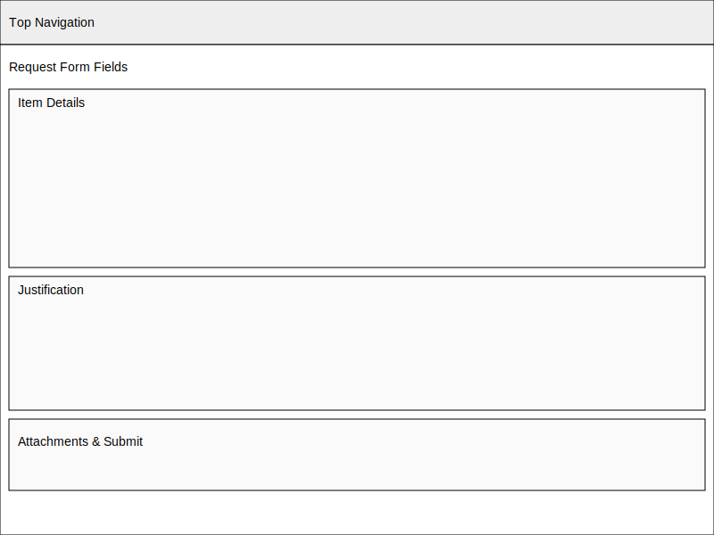

# Request Submission Wireframe

This wireframe illustrates the form used to submit a new procurement request. Key sections include:

- Basic information fields for item details and quantities
- Cost and justification inputs
- Submit and cancel controls
